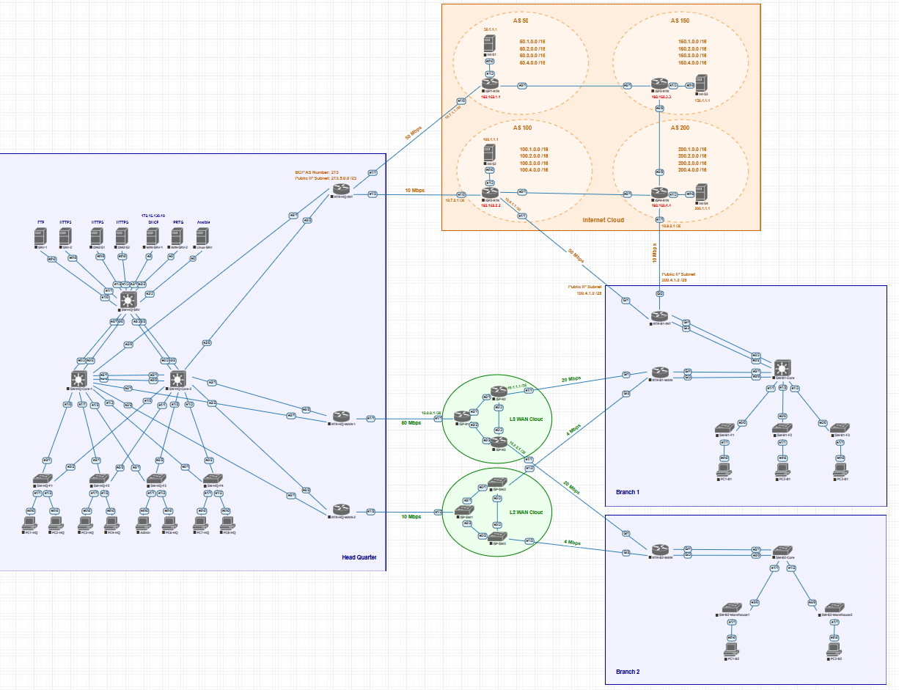

# CCNP Enterprise Practical Lab

## 🎯 Objective
The primary objective of this project is to implement, verify, and troubleshoot a complex Enterprise network environment. This lab covers advanced routing, switching, security, and automation tasks required for CCNP Enterprise certification (ENCOR + ENARSI).

## 🗺️ Topology
The lab is designed using EVE-NG. The topology features a hierarchical campus (Core/Distribution/Access), **multi-site branch connectivity**, and a simulated Internet edge with **redundant ISP connections**.



## 🏗️ Pre-configured Environment
The lab environment is provided with the following pre-existing configurations and baseline connectivity:
* **Topology:** Physical cabling and node placement (Core, Distribution, Access, and ISP routers) are pre-defined in the `.unl` project file.
* **WAN/ISP Links:** WAN connectivity and ISP-side interface parameters are pre-provisioned, serving as the demarcation point for internal enterprise routing.
* **Base Connectivity:** Initial interface assignments are set to facilitate immediate lab entry and testing.

## 🚀 Lab Objectives & Implementation Scope
This lab focuses on the configuration, implementation, and verification of the following enterprise technologies:
* **Layer 2:** VLANs, Trunking, EtherChannel (L2/L3), STP/RSTP/MSTP.
* **Layer 3:** OSPFv2, EIGRP, Route Redistribution, HSRP.
* **WAN:** DMVPN Phase 2, GRE, Site-to-Site IPsec (IKEv1/v2).
* **Security:** ACLs, Port Security, DHCP Snooping, ZBFW, CoPP.
* **Services:** DHCP Server/Relay, NAT/PAT, IP SLA.

## 📁 Repository Contents
```text
.
├── docs/            # Lab Guide PDFs and documentation
├── eve-ng/          # EVE-NG topology files (.unl)
├── configs/         # Device configurations (running-config)
├── topology/        # Network diagrams and screenshots
└── ansible/         # Automation scripts and Jinja2 templates
```
## 🚀 Planned Improvements

- [ ] Implement Python/Netmiko scripts for automated configuration backups.
- [ ] Add network monitoring integration (SNMP and Syslog).
- [ ] Complete IPv6 dual-stack migration.

## 🛠️ Tools Used

- **Network Simulator:** EVE-NG
- **Network Operating System:** Cisco IOS-XE
- **Automation:** Ansible, Jinja2
- **Version Control:** Git and GitHub

## EVE-NG Lab Package
Part 1:
https://my.uupload.ir/dl/n2J2dY6e
Part 2:
https://my.uupload.ir/dl/ODwr7rWx
Part 3:
https://my.uupload.ir/dl/eyJZ5kXD

## EVE-Workshop-v6 Setup Guide
link:
https://my.uupload.ir/p/v9VG5eYr

## ℹ️ About This Project

This lab is a professional-grade study environment designed to simulate real-world enterprise network scenarios and operational constraints. It provides hands-on experience in deploying, troubleshooting, optimizing, and maintaining enterprise infrastructure while preparing for the CCNP Enterprise certification.